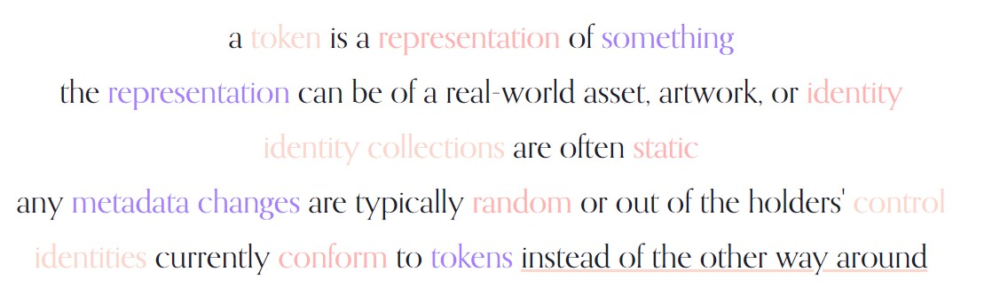
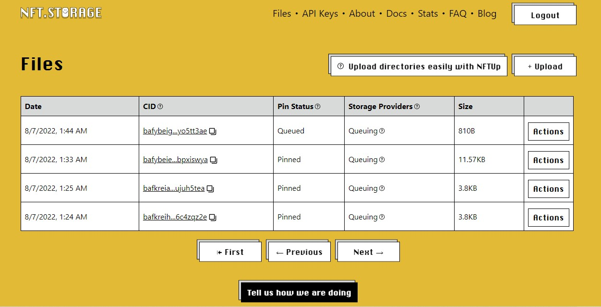

# Attrium

Attrium is an on-chain trait economy built with [Zora V3](https://github.com/ourzora/v3) on [Polygon Mumbai](https://polygon.technology) enabling users to list and buy individual NFT traits to assign to their compatible ERC721 tokens. The Attrium marketplace is host to a single NFT collection: a simplified version of the [Nouns NFT collection](https://nouns.wtf) that implements the novel and (very) experimental [Atomic NFT paradigm](#atomic-nft-paradigm) motivated by [lack of identity composition in NFT avatars](https://#motivation-&-ethos).

## Motivation & Ethos



Attrium believes identity tokens should have the capacity for maximum composability, allowing for true expression of self on the blockchain.

## Atomic NFT Paradigm

Having briefly researched some standards and approches, like [Charged Particles](https://www.charged.fi/) and [RMRK](https://www.rmrk.app/), Attrium takes a different approach of a parent NFT "linked" to "atomic" NFTs. An Atomic NFT is a trait/attribute, only having the properties defined in the [ERC721 Metadata JSON Schema](https://eips.ethereum.org/EIPS/eip-721):

```
{
    "name": string
    "description": string
    "image": string
}
```

An Atomic Parent NFT is a composition of Atomic NFTs.

### Attrium Nouns

The example atomic collection used for Attrium is the homegrown Attrium Nouns. Each metadata attribute is tokenized and minted through dedicated ERC721 contracts. For the sake of being nimble and testing new technologies, all metadata for the attribute NFTs are hosted on IPFS via [NFT.Storage](https://nft.storage).




Inspired by Nouns' on-chain approach, the Atomic NFT paradigm builds upon on-chain `seeds` and leverages OpenZeppelin's `_beforeTransferHook` to ensure atomic ownership *and* metadata changes upon transfer.

## Contracts

The starting point for the 6 core contracts below came from [`nounsDAO/nouns-monorepo/contracts`](https://github.com/nounsDAO/nouns-monorepo/tree/master/packages/nouns-contracts).

**Deployed Contracts (Polygon Mumbai)**

| Contract           | Address (PolygonScan) | Original | Changed from Original | Description |
| -----------        | ----------- | ----------- | ----------- | ----------- |
| AttriumNounsToken  | [0x61aBa107a0494ea676726d119E26cd07c0f52382](https://mumbai.polygonscan.com/address/0x61aBa107a0494ea676726d119E26cd07c0f52382) | [NounsToken](https://github.com/nounsDAO/nouns-monorepo/blob/master/packages/nouns-contracts/contracts/NounsToken.sol) | ✅ | The core ERC721 token contract. Simplified by removing the following functionalities: governance, nounsDAO, Nounders mints, and burning. In the original contract, only the `minters` address could mint. Here, any `EOA` can mint.
| NounsSeeder        | [0xc383bC926a2c3DF2d928e387c380980cc7bCD310](https://mumbai.polygonscan.com/address/0xc383bC926a2c3DF2d928e387c380980cc7bCD310)        | ----------- |
| Inflator        | [0xCbae4dEe00001AD5b5dE7ABDBDbBC0A95384A84e](https://mumbai.polygonscan.com/address/0xc383bC926a2c3DF2d928e387c380980cc7bCD310)        | ----------- |
| Renderer        | [0xea5b72df95DE2cB8f4579AD05A95D97fbe1f0204](https://mumbai.polygonscan.com/address/0xea5b72df95DE2cB8f4579AD05A95D97fbe1f0204)        | ----------- |
| NounsArt        | [0x114282483bc4687e67387d42ef4907062aeacaba](https://mumbai.polygonscan.com/address/0x114282483bc4687e67387d42ef4907062aeacaba)        | ----------- |
| NounsDescriptorV2        | [0xe9F14b1CC05E5FcBe747cA248112594d56C20D77](https://mumbai.polygonscan.com/address/0xe9F14b1CC05E5FcBe747cA248112594d56C20D77)        | ----------- |

